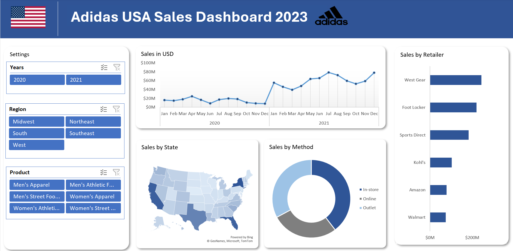

# Adidas USA Sales Excel Dashboard
## Overview
The Adidas USA Sales Dashboard is an interactive Excel-based project designed to analyze sales data for Adidas across regions, years, and product categories. It provides clear visual insights into key performance metrics to support data-driven business analysis.
#### Dashboard File
My final dashboard is in [Adidas_Sales_Dashboard.xlsx](./Adidas_US_Sales%20Dashboard.xlsx)
## Excel Skills Used
- __Pivot Tables —__ Aggregating and summarizing sales data.
- __Data Visualization —__ Line, bar, donut, and map charts.
- __Slicers —__ Interactive filters for year, region, and product.
## Dashboard Preview

## Key Insights
- The Western region recorded the highest overall sales.
- In-store and online channels dominated total revenue compared to outlets.
- Footwear emerged as the most profitable product category.
- West Gear and Foot Locker emerged as top retailers in sales volume.
- Strong growth trend in 2021, particularly in Q2–Q3.
## Outcomes
- Built a professional-grade, interactive Excel dashboard suitable for business reporting.
- Strengthened skills in data cleaning, visualization, and dashboard storytelling.